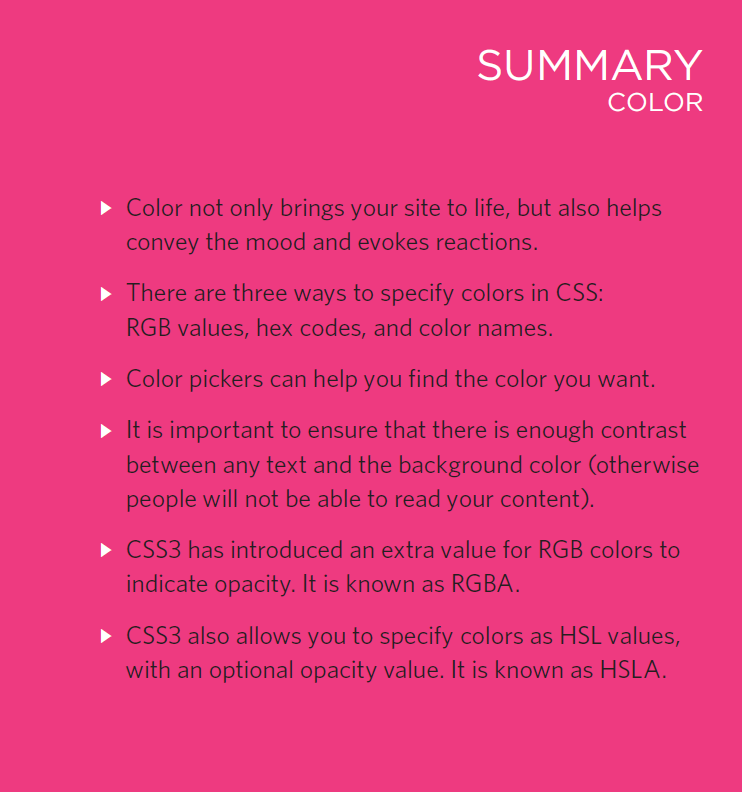
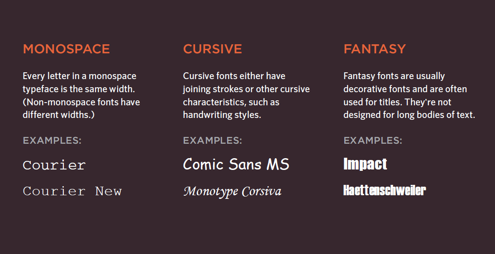
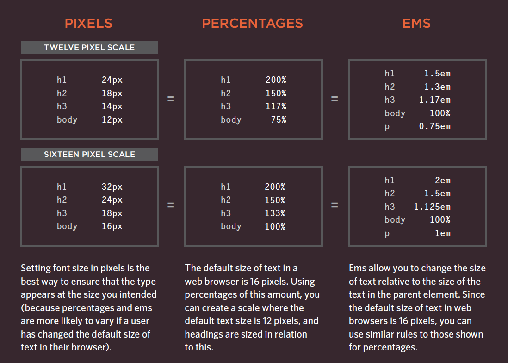

# reading note 05

## Img

To add an image into the page
you need to use an 
element. This is an empty
element (which means there is
no closing tag). It must carry the
following two attributes:
src
This tells the browser where
it can find the image file. This
will usually be a relative URL
pointing to an image on your
own site. (Here you can see that
the images are in a child folder
called images — relative URLs
were covered on pages 83-84).
alt
This provides a text description
of the image which describes the
image if you cannot see it.
title
You can also use the title
attribute with the  element
to provide additional information
about the image. Most browsers
will display the content of this
attribute in a tootip when the
user hovers over the image.

Use JPEG format for all images that contain a natural scene or photograph where variation in colour and intensity is smooth. Use PNG format for any image that needs transparency, or for images with text & objects with sharp contrast edges like logos. Use GIF format for images that contain animations.

